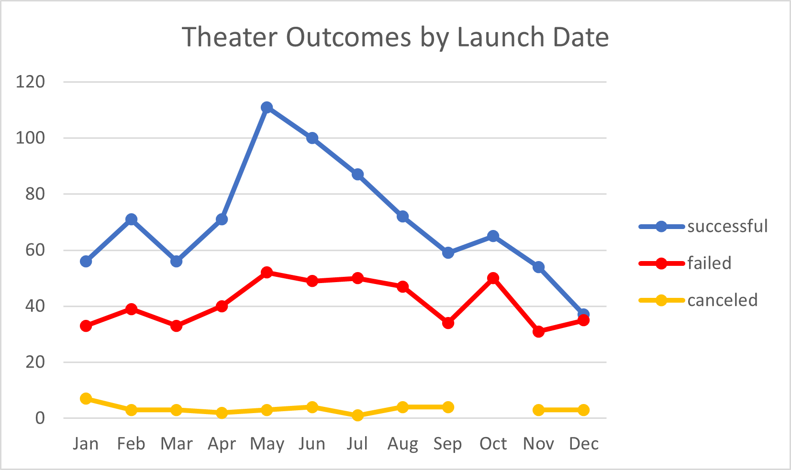

# Kickstarter Theater Campaign Analysis with Excel

## 
Analyze Kickstarter data to help decide the next successful theater campaign

<a href="#goal">Goal</a> &nbsp;&bull;&nbsp;
<a href="#dataset">Dataset</a> &nbsp;&bull;&nbsp;
<a href="#project-overview">Project Overview</a> &nbsp;&bull;&nbsp;
<a href="#tools-used">Tools Used</a> &nbsp;&bull;&nbsp;
<a href="#objectives">Objectives</a> &nbsp;&bull;&nbsp;
<a href="#results">Results</a> &nbsp;&bull;&nbsp;
<a href="#summary">Summary</a>

# Goal
The client ran a Kickstarter campaign for a play called "Fever" that almost reached its goal in a short amount of time. The aim is to look at data from all other Kickstarter Theater campaigns, then perform an analysis to identify trends amongst other Successful fundraisers. The findings will help narrow down parameters for the client's following fundraiser.

# Dataset

Kickstarter campaign data was compiled from the years 2009-2017 in an Excel spreadsheet, then analyzed trends based on Launch Date and Funding Goals and their effect on campaign success.

- [Kickstarter Analysis](data/kickstarter_analysis.xlsx): Explain source of file, size of dataset and format

# Tools Used

- **Microsoft Excel:** Spreadsheet used to analyze dataset and produce visualizations

# Objectives
In depth detail on steps taken to solve problem, including tools and how we modeled the data, include screenshots and code snippets

# Results

# Summary

[Back to top](#kickstarter-theater-campaign-analysis-with-excel)

