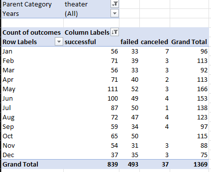
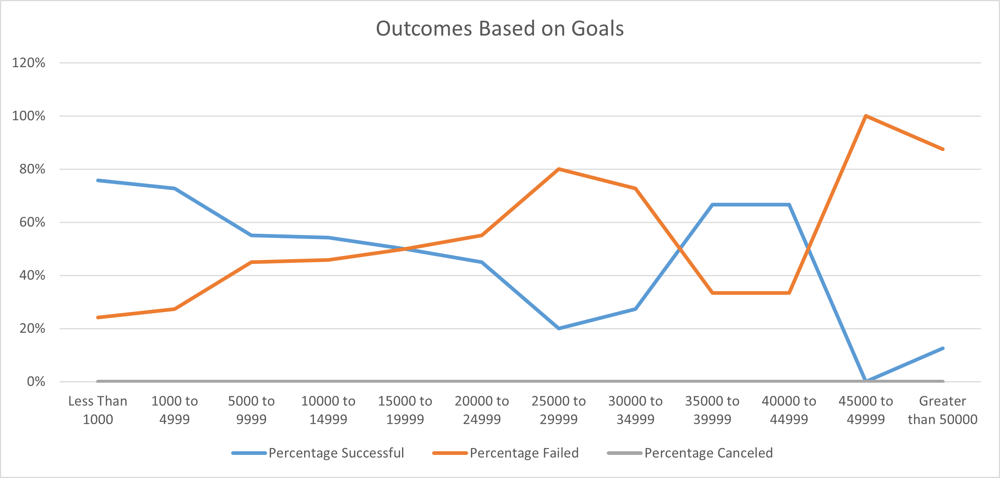
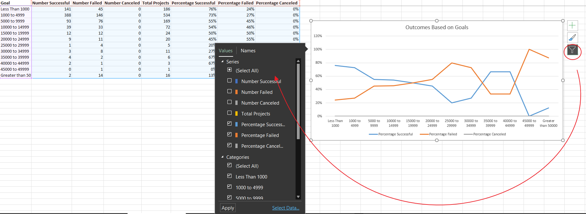

# Kickstarter Theater Campaign Analysis with Excel

## 
Analyze Kickstarter data to help decide the next successful theater campaign

<a href="#goal">Goal</a> &nbsp;&bull;&nbsp;
<a href="#dataset">Dataset</a> &nbsp;&bull;&nbsp;
<a href="#project-overview">Project Overview</a> &nbsp;&bull;&nbsp;
<a href="#tools-used">Tools Used</a> &nbsp;&bull;&nbsp;
<a href="#analysis-and-challenges">Analysis and Challenges</a> &nbsp;&bull;&nbsp;
<a href="#results">Results</a> &nbsp;&bull;&nbsp;
<a href="#summary">Summary</a>

# 
Goal

The client ran a Kickstarter campaign for a play called "Fever" that almost reached its goal in a short amount of time. The aim is to look at data from all other Kickstarter Theater campaigns, then perform an analysis to identify trends amongst other Successful fundraisers. The findings will help narrow down parameters for the client's following fundraiser.

# Dataset
Kickstarter campaign data was compiled from the years 2009-2017 in an Excel spreadsheet, then analyzed trends based on Launch Date and Funding Goals and their effect on campaign success.

- [Kickstarter Analysis](data/kickstarter_analysis.xlsx): Explain source of file, size of dataset and format

# Tools Used
- **Microsoft Excel:** Spreadsheet used to analyze dataset and produce visualizations

# Analysis and Challenges

## Analysis of Outcomes Based on Launch Date

First a pivot table was generated from the original data set using the **Outcomes** in the column portion, **Date Created** in the row portion, with the **Parent Category** and **Years** as filters, as seen in the screenshot below:

The filter feature was used to focus solely on the "Theater" category, then filter the Outcomes to highlight the Successful, Failed and Canceled campaigns.

Using that filtered pivot table, a line chart was generated to visualize the relationship between launch dates and the count of Successful, Failed and Canceled Theater Kickstarter campaigns:

## Analysis of Outcomes Based on Goals

A simple table was created to analyze the campaign funding goals. Funding tiers were determined to summarize the count of Successful, Failed and Canceled Play campaigns. Please see the completed table in the table below:

COUNTIFS formulas were used, such as the quoted one below, to calculate the count of Successful plays within each goal tier outlined in the table.

> =COUNTIFS(Kickstarter!$F:$F,"successful",Kickstarter!$D:$D,"<1000",Kickstarter!$R:$R,"plays")

A percentage of each outcome was calculated in order to generate the line chart below:

This line chart used the Goal column along the X-Axis, and Percentage of Outcomes along the Y-Axis. A legend was included that depicted colored lines that corresponded to the Percentage of Successful, Failed and Canceled plays based on the Goal amount.

## Challenges and Difficulties Encountered
- The dates in the initial data set were in UNIX format, which is very difficult for customers and analysts to read. It also made it harder to organize pivot tables and charts. Excel formulas were used to convert the UNIX dates to a more readable Day/Month/Year format.
- Originally, the **Parent Category** and **Subcategory** data of each Kickstarter campaign were in the same column. Excel's text to columns feature was used to split this data into two separate columns respectively titled "Parent Category" and "Subcategory". This allowed separate analyses to be performed for the **Theater** category and the **Plays** subcategory.
- Upon generating the line chart for the Play Outcomes vs Goals table, there was a lot of noise. Since the entire table was highlighted to generate the chart, the formatting of the chart was adjusted using filter feature. Columns from the original table that were meant to be excluded were deselected. Here is a screenshot of how this was accomplished:

# Results

# Summary

[Back to top](#kickstarter-theater-campaign-analysis-with-excel)

